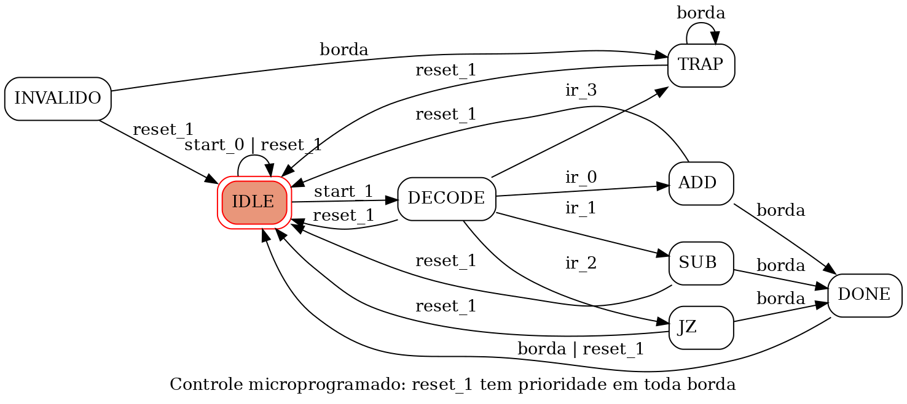
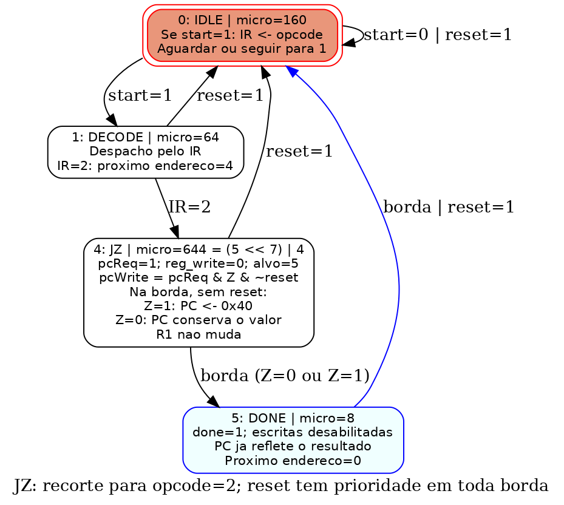

# Arquitetura de Computadores — materiais para alunos

Materiais selecionados pelo professor Alexandre Cassimiro Andreani para a
disciplina de Arquitetura de Computadores, IFSP Câmpus Jacareí.

## Materiais disponíveis

Encontro 5, Lista 1 — soluções em Python/PyRTL:

- [Exercício 1: somador de oito bits](encontro-05/lista-01/solucao_encontro5_lista1_exercicio1.py)
- [Exercício 2: banco de registradores com duas leituras](encontro-05/lista-01/solucao_encontro5_lista1_exercicio2.py)
- [Exercício 3: porta de escrita e habilitação](encontro-05/lista-01/solucao_encontro5_lista1_exercicio3.py)

Encontro 6 — unidade de controle em PyRTL:

- [Exemplo resolvido 1: ADD com controle autônomo](encontro-06/exemplo_resolvido1_encontro6.py): máquina de estados, sinais de controle e trace ciclo a ciclo.
- [Controle cabeado e microprogramado](encontro-06/encontro6_controle_pyrtl.py): dois controladores para o mesmo caminho de dados, com simulação por ciclos.
- [Testes dos controladores](encontro-06/test_encontro6_controle_pyrtl.py): verificação de resultados, estados, reset, protocolo e equivalência.

## Como executar

Com Python 3.9 ou superior instalado, abra um terminal na pasta do repositório:

```bash
python -m venv .venv
```

Ative o ambiente com `source .venv/bin/activate` no Linux/macOS ou
`.venv\Scripts\activate` no Windows. Depois execute:

```bash
python -m pip install pyrtl pytest
python encontro-05/lista-01/solucao_encontro5_lista1_exercicio1.py
python encontro-05/lista-01/solucao_encontro5_lista1_exercicio2.py
python encontro-05/lista-01/solucao_encontro5_lista1_exercicio3.py
python encontro-06/exemplo_resolvido1_encontro6.py
python encontro-06/encontro6_controle_pyrtl.py
```

Cada solução inclui verificações automáticas e saída para acompanhamento.

Para executar a suíte de testes do encontro 6, na raiz do repositório:

```bash
python -m pytest -q encontro-06/test_encontro6_controle_pyrtl.py
```

## Encontro 6, parte 2: exemplo resolvido 1

[Código completo em PyRTL e transitions](encontro-06/exemplo1_parte2_encontro6.py).
O programa constrói a ROM de controle de 8 palavras de 10 bits, extrai seus
campos e executa ADD e SUB. A codificação usa alvo nos bits 9:7 e os sinais
de escrita/subtração nos bits 0 e 1:

- ADD: `(5 << 7) | 1 = 641 = 0x281`.
- SUB: `(5 << 7) | 3 = 643 = 0x283`.

Com R2=5 e R3=7, ADD armazena 12 e SUB armazena 254 (padrão de -2 em
complemento de dois de oito bits). R1 muda na observação de DONE, após a borda
que encerra o estado de execução. A saída combinacional da ULA pode mudar
depois disso sem alterar R1, pois a escrita está desabilitada.

Para executar, instale também o **Graphviz do sistema**, que fornece o comando
`dot` (por exemplo, `sudo apt install graphviz` no Ubuntu ou
`brew install graphviz` no macOS; no Windows, instale Graphviz e inclua seu
diretório `bin` no PATH). O pacote Python `graphviz` não instala esse executável.

```bash
python -m pip install pyrtl transitions graphviz
python encontro-06/exemplo1_parte2_encontro6.py
```

O script imprime a ROM e os traces, verifica 72 cenários e 128 combinações de
sequenciamento, e gera PNG/SVG na própria pasta. Validado com Python 3.11,
PyRTL 1.0.3, transitions 0.9.3 e graphviz 0.21.

PyRTL implementa o circuito. A `GraphMachine` da biblioteca
[transitions](https://github.com/pytransitions/transitions) representa e desenha
a sequência de estados; não substitui o caminho de dados. O adaptador `avancar`
seleciona um evento por borda e dá prioridade ao reset. `start_0/start_1`
representam start=0/1; `ir_0` a `ir_3` representam o IR capturado.
Sem reset, os eventos `borda` completam os demais estados; start é ignorado
fora de IDLE. JZ sempre segue para DONE: Z condiciona a escrita do PC,
não essa transição. INVALIDO representa o código de estado 7.



[Diagrama vetorial SVG](encontro-06/maquina_microprogramada_encontro6.svg).

## Encontro 6, parte 2: exemplo resolvido 2

[Código de JZ e equivalência dos controles](encontro-06/exemplo2_parte2_encontro6.py).
Compara os sinais e estados dos controles cabeado e microprogramado, mostrando
JZ tomado (R1=0, PC recebe 0x40) e não tomado (R1 diferente de zero, PC preservado).
A microinstrução 644 solicita a escrita, mas o enable final depende de Z e reset.
Nos dois casos, o sequenciamento é IDLE → DECODE → JZ → DONE → IDLE.

Mantenha `encontro6_controle_pyrtl.py` e `exemplo1_parte2_encontro6.py` na mesma
pasta: o exemplo reutiliza esses circuitos. Com as dependências Python e o
Graphviz do sistema instalados conforme a seção anterior, execute:

```bash
python encontro-06/exemplo2_parte2_encontro6.py
```

O programa imprime os traces, verifica 512 casos de JZ, oito casos de
equivalência e dois casos de reset, e gera os diagramas PNG/SVG com transitions.
Os estados do desenho incluem a microinstrução e as ações do caminho de dados.



[Diagrama vetorial SVG](encontro-06/maquina_jz_exemplo2_encontro6.svg).

## Encontro 7, Lista 1: exercício 2

[Solução em Python/PyRTL](encontro-07/lista-01/solucao_encontro7_lista1_exercicio2.py).
Gera as 16 combinações de destino/base para LOAD com imediato 12,
confere todas as saídas do decodificador com asserts e imprime os resultados.
O arquivo inclui a base necessária e pode ser executado sozinho:

```bash
python -m pip install pyrtl==1.0.3
python encontro-07/lista-01/solucao_encontro7_lista1_exercicio2.py
```

`LOAD R1,[R2+12]` resulta em `0x360C` (13836). Trocar o índice seleciona
outro registrador, não altera diretamente seu conteúdo. Este circuito
somente decodifica: não lê RAM nem escreve registradores.

## Seleção dos materiais

Este repositório recebe apenas materiais explicitamente escolhidos pelo
professor. A publicação é manual; não há sincronização automática com a pasta
de trabalho ou com o Google Drive. A presença de um arquivo nesses locais não
autoriza sua publicação aqui.

Novos materiais só serão adicionados após a decisão do professor.
